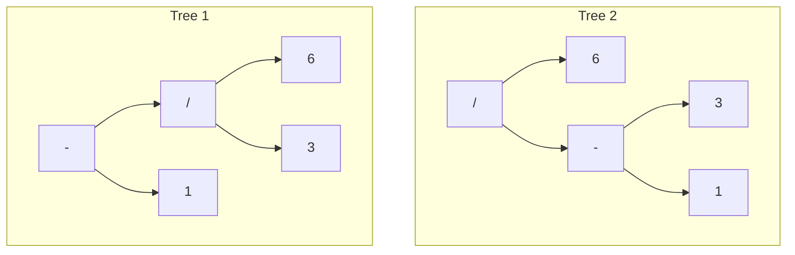

# Parsing Expressions

Parsers map tokens in the grammar to create a syntax tree.

There can be ambiguities. Example: ` 6 / 3 - 1` could produce these trees:



Rules for addressing these ambiguities:

- **Precedence** determines which operator is evaluated first in an expression
  containing a mixture of _different operators_.
  - Higher precedence evaluate before operators with lower precedence.
  - Operators with higher precedence are said to "bind tighter".

- **Associativity** determines which operator is evaluated in a series of the _same
  operator_. 
  - Left-associative: operators evaluate from left to right. \
    Example: `5 - 3 - 1` is equivalent to `(5 - 3) - 1`.
  - Right-associative operators evaluate from right to left. Assignment
    operator is right associative. \
    Example: `a = b = c` evaluates to `a = (b = c)`.
  - Non-associative operators cannot be used more than once in a sequence. \
    Example: Perl's range operator. `a .. b` is valid, but `a .. b .. c` is not.

**Rules for Lox**

| Name       | Operators         | Associates |
|:-----------|:------------------|:-----------|
| Equality   | `==` `!=`         | Left       |
| Comparison | `>` `>=` `<` `<=` | Left       |
| Term       | `-` `+`           | Left       |
| Factor     | `/` `*`           | Left       |
| Unary      | `!` `-`           | Right      |


- When defining a grammar, each rule matches expressions at its **precedence level or
  higher**.
- We need to fill in the productions for each of these rules.

There are multiple ways to define a grammar. For example, `factor` can be defined as:

```bnf
factor         → factor ( "/" | "*" ) unary
               | unary ;
```

The first symbol of in the body of the rule is same as the head of the rule. This
production is **left-recursive**. Some parsing techniques (like recursive descent) have
trouble with left recursion (the function for left-recursive rule immediately calls
itself, which calls itself again, and so on).

We'll go with a different definition, defining the `factor` expression as a flat
_sequence_, which better mirrors the code that we'll write to parse Lox.

```bnf
factor         → unary ( ( "/" | "*" ) unary )* ;
```

Using the same structure gives us this complete expression grammar:

```bnf
expression     → equality ;
equality       → comparison ( ( "!=" | "==" ) comparison )* ;
comparison     → term ( ( ">" | ">=" | "<" | "<=" ) term )* ;
term           → factor ( ( "-" | "+" ) factor )* ;
factor         → unary ( ( "/" | "*" ) unary )* ;
unary          → ( "!" | "-" ) unary
               | primary ;
primary        → NUMBER | STRING | "true" | "false" | "nil"
               | "(" expression ")" ;
```

## Recursive Descent Parsing

There is a whole pack of parsing techniques:
[LL(k)](https://en.wikipedia.org/wiki/LL_parser),
[LR(1)](https://en.wikipedia.org/wiki/LR_parser),
[LALR](https://en.wikipedia.org/wiki/LALR_parser)—along with more exotic beasts
like [parser combinators](https://en.wikipedia.org/wiki/Parser_combinator),
[Earley parsers](https://en.wikipedia.org/wiki/Earley_parser),
[the shunting yard algorithm](https://en.wikipedia.org/wiki/Shunting-yard_algorithm),
and [packrat parsing](https://en.wikipedia.org/wiki/Parsing_expression_grammar).
For our first interpreter, one technique is more than sufficient: **recursive descent**.

- Recursive descent is the simplest way to build a parser, and doesn't require
  parser generator tools like Yacc, Bison or ANTLR.
- Recursive descent parsers are fast, robust and can support support
  sophisticated error handling.
- GCC, V8, Roslyn (bootstrapped C# compiler) and several others use recursive descent.
- Recursive descent is a **top-down parser** because it starts from the top or outermost
  grammar rule, and works its way down into the nested subexpressions before reaching
  the leaves of the syntax tree.
- Bottom-up parsers like LR start with primary expressions and compose them into larger
  and larger chunks of syntax.


A recursive descent parser is a literal translation of the grammar's rules into
imperative code, where each rule becomes a function.

The body of the rule translates to code roughly like:

| Grammar notation | Code representation               |
|:-----------------|:----------------------------------|
| Terminal         | Code to match and consume a token |
| Nonterminal      | Call to that rule's function      |
| `\|`             | `if` or `switch` statement        |
| `*` or `+`       | `while` or `for` loop             |
| `?`              | `if` statement                    |


## Syntax Errors

A parser has two jobs:

1. Given a valid sequence of tokens, produce a corresponding syntax tree.
2. Given an invalid sequence of tokens, detect any errors and report them.

In modern IDEs and editors, the parser is constantly parsing code—often while the user
is still editing it—in order to syntax highlight, auto-complete, etc. That means it will
encounter code in incomplete, half-wrong states _all the time_.

A few hard requirements for when the parser runs into a syntax error. A parser must:
- Detect and report the error. It should not result in a malformed syntax tree.
- Avoid crashing or hanging when it encounters an invalid input. It should not segfault
  or get stuck in an infinite loop.
- Be fast. The editors are expected to reparse files in milliseconds after every
  keystroke.
- Report as many distinct errors as there are. It's annoying if a new errors appears in
  the file once users fix an error. Show them all.
- Minimize _cascaded_ errors. A parser may keep going once a single errors is found. But
  if it's confused, it may report a slew of ghost errors. When the first errors is
  fixed, those phantoms disappear, because they reflect only the parser's own confusion.
  Cascaded errors can scare the user into thinking their code is in a worse state than
  it is.

The last two points are in tension. We want to report many separate errors, but not the
ones that are merely side effects of an earlier one.

The way a parser responds to an error and keeps going is called **error recovery**.

### Panic mode error recovery

- One of the recovery techniques that best stood the test of time is called—somewhat
  alarmingly—**panic mode**.
- As soon as the parser detects an error, it enters panic mode. It knows that at least
  one token doesn't make sense.
- Before continuing with parsing, the parser needs to align its state and the sequence
  of forthcoming tokens such that the next token _does_ match a rule. This process is
  called **synchronization**.
- To do that, we select some rule in the grammar that will mark the synchronization
  point. The parser fixes its parsing state by jumping out of any nested productions
  until it can start parsing again.
- Additional real syntax errors hiding in those discarded tokens aren't reported. But it
  also means that any mistaken cascaded errors that are side effects aren't falsely
  reported either.
- The traditional place in the grammar to synchronize is between statements. Discard
  tokens until we're right at the beginning of the next statement.

### Error Productions

- Another way to handle _common_ syntax errors is with error productions.
- Augment the grammar with a rule that _successfully_ matches the _erroneous_ syntax.
  The parser safely parses it but reports it as an error.

## Challenges

### Comma operator

> Implement the [comma operator](https://en.wikipedia.org/wiki/Comma_operator) that
> allows > a comma separated series of expressions where a single expression is expected
> (except inside a function call's argument list). At runtime, the comma operator
> evaluates the left operand and discards the result. Then it evaluates and returns the
> right operand.

As per the [C Operator Precedence][c-operator-precedence], `,` has the lowest
precedence, and is left-associative.

### Ternary operator

> Add support for the C-style conditional or “ternary” operator `?:`. What precedence
> level is allowed between the `?` and `:`? Is the whole operator left-associative or
> right-associative?

The precedence of the ternary operator will be higher than comma and assignment
operators, and lower than everything else (as per the [C Operator
Precedence][c-operator-precedence])

It will have right associativity.

Grammar rule:

```bnf
ternary        → equality "?" ternary ":" ternary
               | equality ;
```

[c-operator-precedence]: https://en.cppreference.com/w/c/language/operator_precedence
